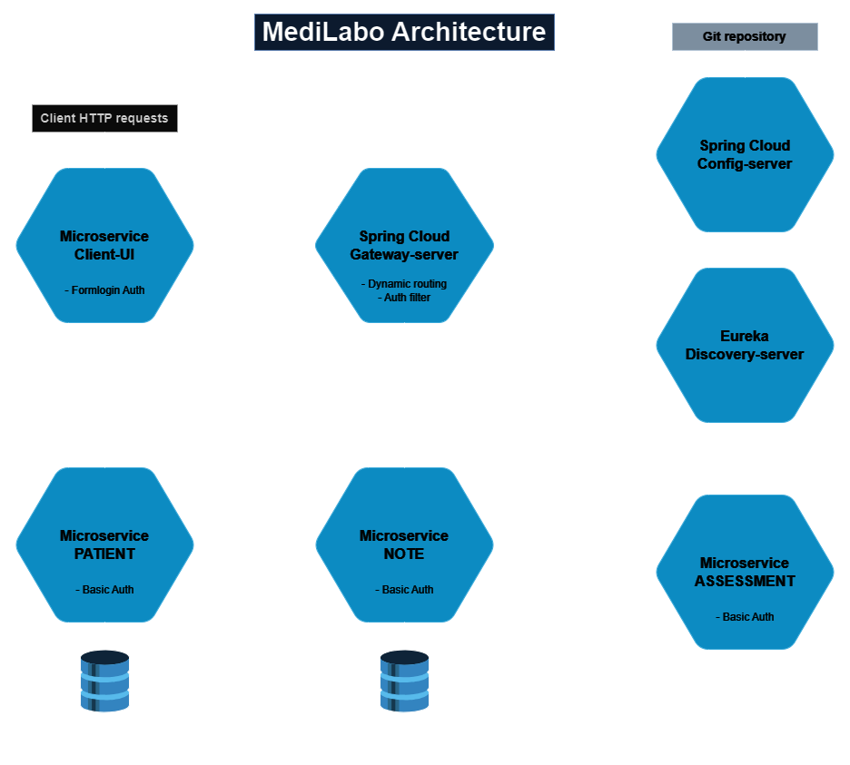

# MediLabo

MediLabo is an application based on a microservices architecture to manage various medical entities, such as patients, notes, and assessments. Based on patient data and "risk terms" from notes, the assessment service calculates the risk level of diabetes for patients.

## Table of Contents

- [Architecture](#architecture)
- [Components](#components)
- [Prerequisites](#prerequisites)
- [Installation](#installation)
- [Usage](#usage)
- [Configuration](#configuration)
- [Technologies Used](#technologies-used)
- [Languages and Development Tools](#languages-and-development-tools)
- [Unit and Integration Tests](#unit-and-integration-tests)
- [Green Code - Sustainable Development Practices](#green-code---sustainable-development-practices)

## Architecture

MediLabo uses a microservices architecture:

- Each microservice is autonomous and can be deployed independently (Docker container).
- Services communicate via secure HTTP calls and are registered with Eureka for service discovery.
- Traffic routing between microservices is managed by an API gateway (Spring Cloud Gateway).
- Multiple instances of each backend microservice (patient, note, and assessment) can be run for scalability and fault tolerance.
- Centralized configuration is provided by a Spring Cloud Config server.



## Components

MediLabo consists of the following microservices:

1. **Config Server**: Provides centralized configurations for all microservices.
2. **Discovery Server**: Eureka server for service discovery.
3. **Gateway Server**: API gateway for managing traffic between microservices.
4. **Patient Microservice**: Manages patient data.
5. **Note Microservice**: Manages notes associated with patients.
6. **Assessment Microservice**: Assesses the risk level of patients.
7. **ClientUI Microservice**: Front-end user interface to interact with the application.

## Prerequisites

Before starting, make sure you have the following installed on your machine:

1. **JDK/JRE Java 21**: A Java virtual machine is required to run the microservices in development mode or to run tests. You can download Java [here](https://www.oracle.com/java/technologies/downloads/#java21).
2. **Maven**: For dependency management and project build. You can download Maven [here](https://maven.apache.org/download.cgi).
3. **Docker**: For containerizing applications. You can download Docker [here](https://www.docker.com/products/docker-desktop).
4. **Git**: To clone the repository. You can download Git [here](https://git-scm.com/downloads).

## Installation

To install and run MediLabo locally, follow these steps:

1. Clone the repository:

    ```bash
    git clone https://github.com/maximedrouault/MediLabo.git
    cd MediLabo
    ```

2. Configure your environment variables in the `.env` and `docker-compose.yml` files for the necessary services.
- Functional examples of `.env` files are provided in the `.env.example` files that you just need to rename:
- `/.env.example` -> `/.env` for environment variables intended for Docker image builds.
- `/config-server/.env.example` -> `/config-server/.env` for environment variables intended for starting the configuration server in development mode.

### Option 1: Start in production mode (the simplest and recommended)

1. Launch `docker-compose` to build and start the containers with the defined orchestration and health check conditions:

    ```bash
    docker-compose -f docker-compose-prod.yml up --build
    ```

### Option 2: Start in development mode

1. Launch `docker-compose` to start the MongoDB and MySQL databases:

    ```bash
    docker-compose -f docker-compose-dev.yml up --build
    ```

2. Manually start the microservices with the `DEV` profile in this order:

    ```bash
    mvn -f config-server/pom.xml spring-boot:run -Dspring-boot.run.profiles=dev
    ```
    ```bash
    mvn -f discovery-server/pom.xml spring-boot:run -Dspring-boot.run.profiles=dev
    ```
    ```bash
    mvn -f gateway-server/pom.xml spring-boot:run -Dspring-boot.run.profiles=dev
    ```
    ```bash
    mvn -f microservice-patient/pom.xml spring-boot:run -Dspring-boot.run.profiles=dev
    ```
    ```bash
    mvn -f microservice-note/pom.xml spring-boot:run -Dspring-boot.run.profiles=dev
    ```
    ```bash
    mvn -f microservice-assessment/pom.xml spring-boot:run -Dspring-boot.run.profiles=dev
    ```
    ```bash
    mvn -f microservice-clientui/pom.xml spring-boot:run -Dspring-boot.run.profiles=dev
    ```

## Usage

- The application can be accessed via the user interface at http://localhost:8080.
- Test credentials to access the user interface are:
    - **Login**: `user`
    - **Password**: `1234`

### OpenAPI/Swagger Documentation

- **Patient Microservice**:
    - URL: http://localhost:9000/swagger-ui.html
    - **Login**: `patient_api_user_test`
    - **Password**: `patient_api_password_test`

- **Note Microservice**:
    - URL: http://localhost:9100/swagger-ui.html
    - **Login**: `note_api_user_test`
    - **Password**: `note_api_password_test`

- **Assessment Microservice**:
    - URL: http://localhost:9200/swagger-ui.html
    - **Login**: `assessment_api_user_test`
    - **Password**: `assessment_api_password_test`

## Configuration

- Configuration files are located in the `src/main/resources` directory of each microservice.
- You can configure profiles for development and production in the `bootstrap-dev.yml`, `bootstrap-prod.yml` files.
- Centralized configurations are stored in the Git repository defined in the configuration server's `application.yml` file, and sensitive data is encrypted. You can redefine configurations as needed.

## Technologies Used

### Frameworks and Libraries

- **Spring Boot**: To create microservices.
- **Spring Cloud**: For centralized configuration, service discovery, and API gateway.
- **Spring Security**: For security and authentication management.
- **Spring Data JPA**: For data access and CRUD operations with PostgreSQL.
- **Spring Data MongoDB**: For data access and CRUD operations with MongoDB.
- **Spring Boot Validation**: For data validation.
- **Spring Actuator**: For application monitoring and management.
- **Feign**: For declarative HTTP clients.
- **Lombok**: To reduce boilerplate code.
- **Thymeleaf**: Template engine for the user interface.
- **WireMock**: For integration tests simulating external services.
- **Bootstrap**: For front-end CSS styling.

### Databases

- **PostgreSQL**: Database for the Patient service.
- **MongoDB**: Database for the Note service.

### Containerization

- **Docker**: For containerizing applications.

### Languages and Development Tools

- **Java 21**: Version used for microservices development.
- **Maven**: For dependency management and project build.

## Unit and Integration Tests

MediLabo uses several frameworks and libraries for unit and integration tests to ensure code quality and reliability.

### Unit Tests

Unit tests are used to verify the correct functioning of individual components of the application. MediLabo uses the following tools for unit tests:

- **JUnit**: Test framework for Java.
- **Mockito**: Library for creating mocks and stubs.
- **JaCoCo**: Generates code coverage reports for tests.
- **Surefire report**: Generates unit test reports.

To run unit tests, use the following command in the concerned microservice directory:

```bash
mvn clean test site
```

### Integration Tests

Integration tests verify that the different components of the application work correctly together. MediLabo uses the following tools for integration tests:

- **Spring Boot Test**: Provides annotations and utilities for testing Spring Boot components in an integration context.
- **WireMock**: Simulates external services to test HTTP interactions.
- **JaCoCo**: Generates code coverage reports for tests.
- **Surefire report**: Generates integration test reports.

To run integration tests, use the following command in the concerned microservice directory:

```bash
mvn clean verify site
```

### Code Coverage

MediLabo uses JaCoCo to measure test code coverage. Code coverage reports are generated in the `target/site/jacoco/index.html` directory after running the tests.

### Test Reports

MediLabo uses Surefire Report to generate unit and integration test reports. Reports are generated in the `target/site/index.html` directory after running the tests.

## Green Code - Sustainable Development Practices

### Existing Methods

1. **Complex Queries Offloaded to Databases**:
    - Using MongoDB aggregations in the `NoteRepository` to count risk terms in patient notes, thus reducing application-side processing. This approach optimizes server load by transferring computation to databases, which can reduce overall energy consumption.

2. **Creation of Relevant Indexes**:
    - Databases use indexes on relevant fields (e.g., `patientId` in MongoDB), which improves query speed and reduces data access time. This optimizes resource usage and reduces the carbon footprint of data processing.

3. **Query Cost Verification (Explain)**:
    - Using the `explain` approach in MongoDB and PostgreSQL to analyze and optimize query cost. This helps identify costly queries and optimize them, reducing processing time and energy consumption.

4. **Adherence to SOLID, KISS, and DRY Design Principles**:
    - Applying SOLID, KISS (Keep It Simple, Stupid), and DRY (Don't Repeat Yourself) design principles in the code, which helps reduce complexity, avoid redundant code, and facilitate maintenance while minimizing resource consumption.

5. **Using SonarLint for Code Quality**:
    - SonarLint is used to analyze code and detect potential errors, "bad smells," and rule violations, helping maintain quality and performant code.

6. **Using Containerization**:
    - The project uses Docker to containerize applications. This reduces the environmental footprint by consolidating applications on fewer physical servers and optimizing resource usage through container isolation.

7. **Code Profiling**:
    - Using profiling techniques to identify hotspots in the code and optimize performance. This reduces the energy footprint by limiting unnecessary processing cycles.

### Improvement Areas

1. **HTTP Request Compression**:
    - Implement HTTP request compression if they become large, such as Gzip, to reduce the size of transferred data and thus the bandwidth used, which can save energy on both application servers and clients.

2. **Pagination of Lists**:
    - Implement pagination for lists returned by APIs (e.g., patient or note lists) to reduce the amount of transferred data and efficiently allocate resources.